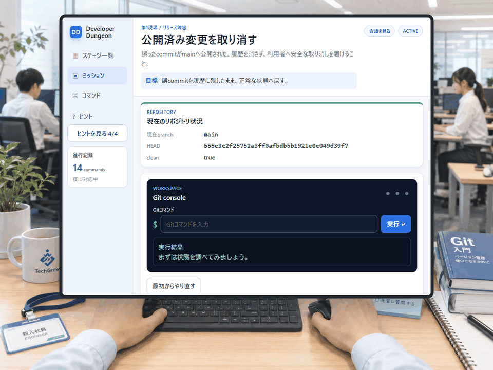
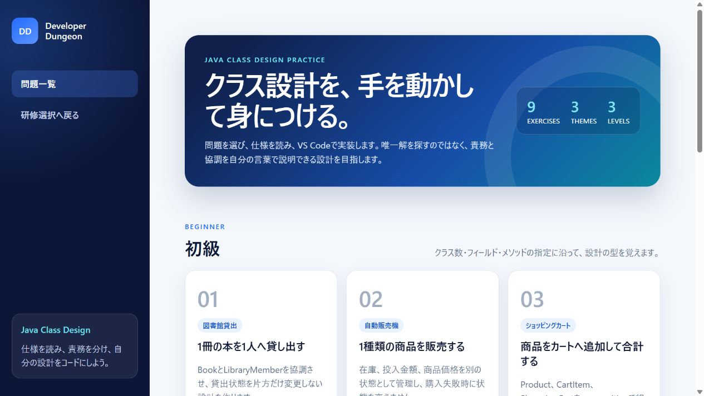
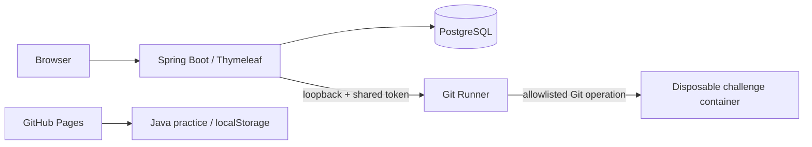

# Developer Dungeon

[](https://github.com/yuya-dev-dev/developer-dungeon/actions/workflows/ci-fast.yml)
[](https://github.com/yuya-dev-dev/developer-dungeon/actions/workflows/ci-persistence.yml)

Developer Dungeonは、実際の開発作業に近い形でGitとJavaクラス設計を学ぶWebアプリケーションです。

- **Git編**: 隔離された使い捨てrepositoryを操作し、コマンド列ではなく最終状態でクリア判定します。
- **Javaクラス設計問題集**: 要求仕様を読み、手元のIDEで実装し、学習進捗を自分で管理します。

## 公開デモ

### [Javaクラス設計問題集をブラウザで試す](https://yuya-dev-dev.github.io/developer-dungeon/)

PCやDockerを起動せず、スマートフォンからも利用できます。図書館貸出、自動販売機、ショッピングカートを初級・中級・上級の9問で学べます。進捗は利用中のブラウザだけに保存されます。

Git編は安全な隔離実行環境を必要とするため、ローカル実行限定です。

## Git編の学習フロー



実際のGit repositoryを観察し、誤った公開commitを特定して`git revert`で取り消しています。入力した手順を唯一解として照合せず、修復後のbranch、commit、working treeなどの状態を採点するため、同じ目標へ到達する妥当な別解も扱えます。

## 収録コンテンツ

| 学習トラック | 内容 | 現在の範囲 |
|---|---|---|
| Git基礎研修 | 状態確認、履歴確認、branch操作を広く浅く復習 | 3課題 |
| Git事故対応 | revert、cherry-pick、stash、merge conflict、reflog | 5ステージ |
| Javaクラス設計 | 要求仕様からclass、field、method、責務を設計 | 3テーマ × 3難易度 |

Java問題集ではサイト内エディタや自動採点を設けていません。問題を読み、VS Codeなどで実装・実行し、必要に応じて模範設計例を開いて比較するという学習に集中させています。



## アーキテクチャ



Git編では画面、進行管理、採点を担うapplicationと、Git操作を担うRunnerを別processに分離しています。各attemptのworkspaceは使い捨てcontainer内に作成し、終了・失敗・timeout時に破棄します。Java公開版は許可した静的成果物だけをGitHub Pagesへ配信し、Runnerや管理DBを含めません。

詳しい責務境界は[`docs/architecture.md`](docs/architecture.md)を参照してください。

## セキュリティ設計

playerが入力するGitコマンドを扱うため、通常のフォーム入力より厳しい境界を設けています。

- host OSやSpring Boot processでplayer由来コマンドを直接実行しない
- shellを経由せず、ステージごとにGit operationと引数を許可する
- Docker socket、host bind mount、管理DB、秘密値をchallenge containerへ渡さない
- network、実行時間、CPU、memory、PID、出力サイズを制限する
- command文字列ではなく、信頼済みrepository snapshotから状態を判定する

脅威と対策は[`docs/threat-model.md`](docs/threat-model.md)に整理しています。

## テストと品質ゲート

| ゲート | 確認内容 | 現在のテスト数 |
|---|---|---:|
| [Fast CI](https://github.com/yuya-dev-dev/developer-dungeon/actions/workflows/ci-fast.yml) | application、domain、template、security境界 | 164 |
| [Persistence CI](https://github.com/yuya-dev-dev/developer-dungeon/actions/workflows/ci-persistence.yml) | PostgreSQL / Flyway統合 | 3 |
| Local Docker integration | Runnerと使い捨てchallenge container | 19 |

Pull Requestでは高速CIとPostgreSQL統合CIを分離して実行します。Docker Desktopを必要とするRunner統合テストは、ローカルの対象環境で実行します。方針とテスト層は[`docs/test-strategy.md`](docs/test-strategy.md)を参照してください。

## 技術スタック

- Java 25 / Spring Boot 4.1.0 / Maven Wrapper
- Thymeleaf / HTML / CSS / JavaScript
- PostgreSQL / Flyway
- Docker Desktop / Linux container / Git 2.52.0
- GitHub Actions / GitHub Pages
- PowerShell 7.6.5 LTS（ローカル起動script）

## ローカル実行

初期対応環境はWindows 11 x86_64、Docker DesktopのWSL 2 backend、Linux containerです。PowerShell 7.6.5 LTS x64で実行してください。

```powershell
.\scripts\build-challenge-image.ps1
.\scripts\invoke-maven.ps1 package
.\scripts\start-local.ps1
```

起動後、`http://127.0.0.1:8080`を開きます。`start-local.ps1`はJDK、Docker Desktop、WSL、Maven Wrapper、challenge imageを事前確認し、要件を満たさない場合はapplicationとRunnerを起動しません。

Dockerを使わない通常テストは次のコマンドで実行できます。

```powershell
.\scripts\invoke-maven.ps1 test
```

## ドキュメント

| 文書 | 内容 |
|---|---|
| [`docs/requirements.md`](docs/requirements.md) | 機能要件、非機能要件、MVP範囲 |
| [`docs/architecture.md`](docs/architecture.md) | component、module、Runner、DB、Docker境界 |
| [`docs/threat-model.md`](docs/threat-model.md) | 信頼境界、脅威、security制御 |
| [`docs/test-strategy.md`](docs/test-strategy.md) | 自動・統合・手動テストの役割 |
| [`docs/java-class-design-practice.md`](docs/java-class-design-practice.md) | Java問題集の9問、画面、進捗、模範code |
| [`docs/sql-practice.md`](docs/sql-practice.md) | 次期PostgreSQL実習問題集のtutorial、4章8問、SQL実行・判定仕様 |
| [`roadmap.md`](roadmap.md) | 完了済みの改善と今後の候補 |
