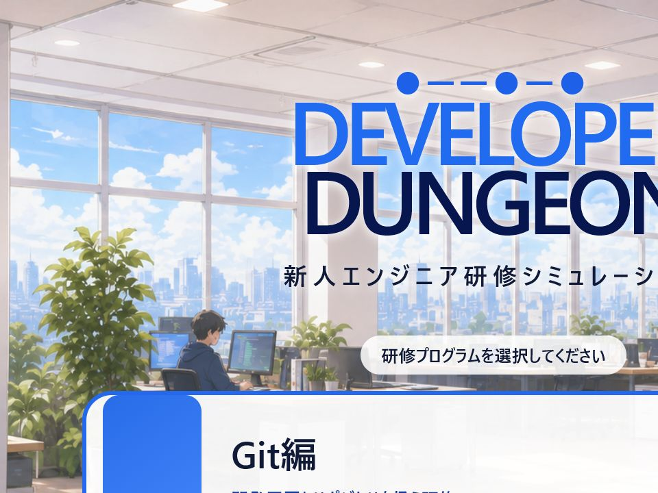
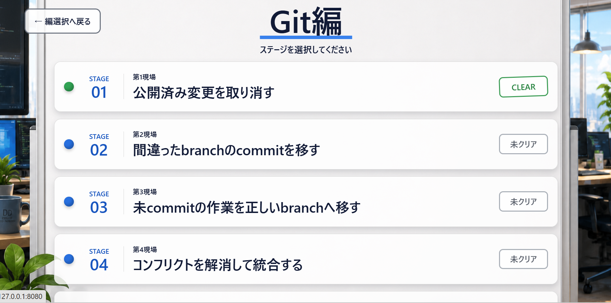
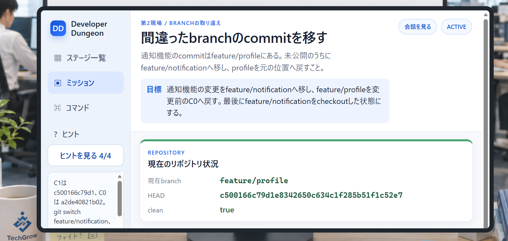
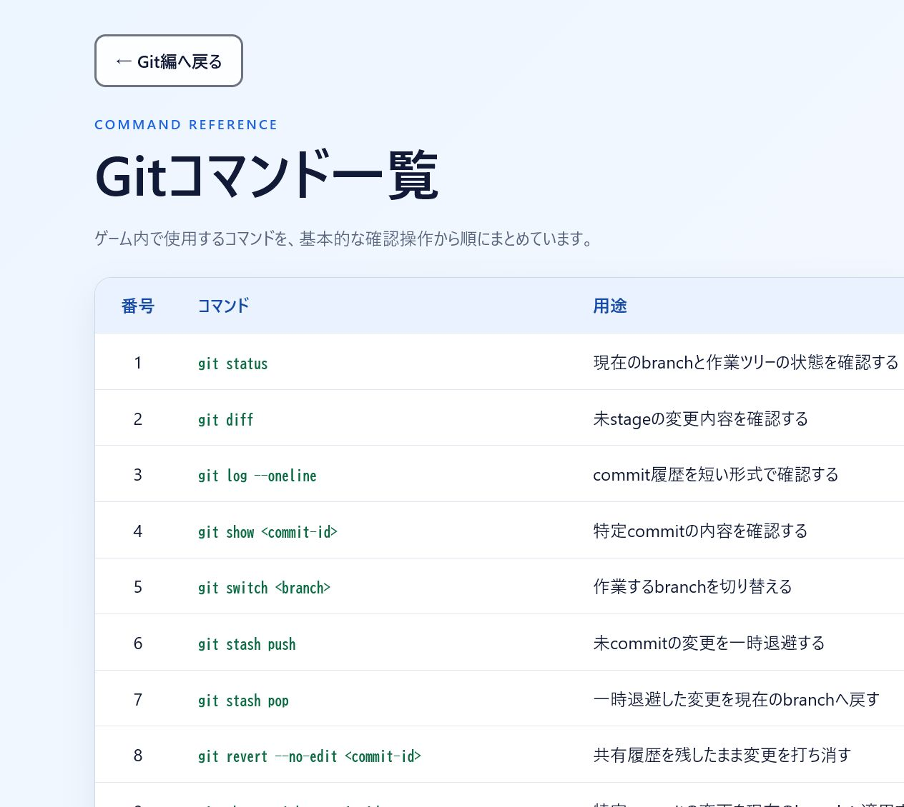

# Developer Dungeon

Developer Dungeonは、新人エンジニアが複数の開発現場で技術的な問題を解決しながら成長する、ゲーム型学習Webアプリケーションです。

現在のリポジトリは**Git編専用**です。プレイヤーは、壊れたGitリポジトリを実際のGitコマンドで調査・復旧します。採点は入力したコマンド列ではなく、修復後のリポジトリ状態を基本とします。

## 現在の状態

Phase 4までの企画・要件・全体設計と実装はユーザー承認済みです。安全な縦切り版、Git Runner hardening、PostgreSQLによるMVP基盤を経て、Chapter 1のSTAGE-GIT-01（revert）からSTAGE-GIT-05（reflog）までとPhase 5改善単位1〜7Dを実装しました。Gitの基本を広く浅く復習するChapter 0のTRAINING-GIT-01〜03も実装し、App／Runner／Docker／PostgreSQLの対象限定テストに成功しています。

現在の1日縦切り版は、安全な使い捨てGit実行環境を含みます。player入力をhost上で直接実行せず、別processのGit Runnerとdisposable challenge containerを使用します。

企画・要件・全体設計の文書一式はユーザー承認済みです。初期対応環境はWindows 11 x86_64＋Docker DesktopのWSL 2 backend／Linux containerに限定し、実装基準versionとRunner方式は[`docs/architecture.md`](docs/architecture.md)を正本とします。

正式なlocal起動はPowerShell 7.6.3 LTS x64の`scripts/start-local.ps1`へ一本化します。JDK、Docker Desktop、WSL、Maven Wrapper、challenge image IDのpreflightに失敗した場合は、app／Runnerを起動しません。

進捗と次段階への条件は[`roadmap.md`](roadmap.md)を参照してください。

## 画面

| タイトル・編選択 | Git編ステージ選択 |
|---|---|
|  |  |

| ステージ画面 | Gitコマンド一覧 |
|---|---|
|  |  |

## ゲームの中心

- 主人公は架空の開発会社へ入社した新人エンジニア
- 複数のプロジェクト現場でGit事故を解決する
- 現実のGit用語とコマンドをそのまま使用する
- 状態の観察、仮説、安全な操作、振り返りを1つのgame loopにする
- 信頼済みsnapshotによる自動クリア後に、復旧完了の根拠を考える非採点・非永続の自己確認を行う
- 4段階hintと累積3スターで、探索を罰せず自力判断を評価する
- 安定版MVPはGit基礎研修3件と、revert、cherry-pick、stash、merge conflict、reflogを扱う事故対応5stage
- Phase 5改善では正確な構文をworkspaceへ常時表示せず、Stage非依存のcommand参照と段階ヒントへ分離する
- Stage 4ではmerge conflict中だけ固定ファイル用のversion token付き限定エディタを表示し、双方の要件と2親のmerge commitを状態採点する
- Stage 5ではHEAD reflogに残る表示済みcommit IDだけを使い、削除済みbranchを元のcommitへ復旧できたかを状態採点する

## 現在の範囲

含む：

- Git編の1日縦切り版
- Git編の安定版MVP（Chapter 0の基礎研修3件＋Chapter 1の事故対応5stage）
- Java / Spring Boot / Thymeleaf
- Git専用Runner
- attemptごとの使い捨てDocker container
- 安定版MVPからPostgreSQL / Flyway

含まない：

- Javaコードレビュー編、SQL編、Docker障害対応編
- ログイン、複数player、ランキング、外部公開
- 汎用Runner、plugin、microservice、stage作成UI
- ライブworkspaceの完了をプレイヤーが宣言する復旧報告と、その待機用TTL・状態機械
- rebase、bisect、実remoteを使う高難度stage

将来編は同じ主人公と世界観で展開できる候補ですが、Git編MVPの完成と検証後に改めて判断します。

## 安全設計

player入力から実Gitを動かす機能は、通常のWeb入力より高い危険性を持ちます。

- host OSやSpring Boot processでplayer由来Gitを実行しない
- shellを経由しない
- stage別にcommandと引数を許可する
- appとGit Runnerを別processにする
- attemptごとにdisposable challenge containerを使用する
- challenge containerへDocker socket、host bind mount、管理DB、外部networkを渡さない
- time、CPU、memory、PID、workspace、outputを制限する
- command履歴ではなく、信頼できるrepository snapshotで採点する

詳細は[`docs/threat-model.md`](docs/threat-model.md)を参照してください。

## 文書

| 文書 | 内容 |
|---|---|
| [`AGENTS.md`](AGENTS.md) | 作業ルール、Git分担、井上・中谷・バムの役割 |
| [`docs/requirements.md`](docs/requirements.md) | 確定要件、MVP範囲、完成条件 |
| [`docs/game-design.md`](docs/game-design.md) | 世界観、game loop、hint、3スター |
| [`docs/chapter-0-training.md`](docs/chapter-0-training.md) | Chapter 0のGit基礎研修3件の操作、fixture、採点仕様 |
| [`docs/git-mvp-stages.md`](docs/git-mvp-stages.md) | Chapter 1のGit事故対応5stageの状態と採点仕様 |
| [`docs/threat-model.md`](docs/threat-model.md) | 信頼境界、脅威、必須security制御 |
| [`docs/architecture.md`](docs/architecture.md) | component、module、Runner、DB、Docker境界 |
| [`docs/vertical-slice.md`](docs/vertical-slice.md) | 1日縦切り版の範囲と完成条件 |
| [`docs/test-strategy.md`](docs/test-strategy.md) | 自動・統合・手動testの方針 |
| [`docs/phase-5-experience-improvement-plan.md`](docs/phase-5-experience-improvement-plan.md) | 内部パイロットの所見、採用した改善、実装分割、再確認条件 |
| [`roadmap.md`](roadmap.md) | 開発段階、完成条件、次へ進む条件 |

文書の優先順位は、`AGENTS.md`、要件定義、脅威モデル、ゲーム・stage仕様、アーキテクチャ、縦切り仕様、テスト戦略、ロードマップ、READMEの順です。

## 開発体制

- メインエージェント: ユーザーとの要件調整、文書、実装、テストコード、差分確認
- バム: 新規・大幅更新した物語、シナリオ、主人公の成長、ゲームとしての面白さのレビュー
- 井上: 企画・要件・全体設計文書の最終一括レビュー、非軽微な実装の事前／事後レビュー
- 中谷: CSS・HTMLだけの編集を除く非軽微な実装後の対象限定test
- ユーザー: `git add`、commit、push、PR、merge、手動確認

作業用branchの作成と切り替えはメインエージェントが担当します。

## 実行方法

Dockerを伴う検証の実行許可後、次の順で起動します。

```powershell
.\scripts\build-challenge-image.ps1
.\scripts\invoke-maven.ps1 package
.\scripts\start-local.ps1
```

Browserで`http://127.0.0.1:8080`を開きます。Dockerを起動しない単体テストは`.\scripts\invoke-maven.ps1 test`で実行します。このlauncherは、Codexやterminalが古い`JAVA_HOME`を継承していても、必須のEclipse Temurin 25.0.3+9 x64を検出して、そのMaven processにだけ適用します。
