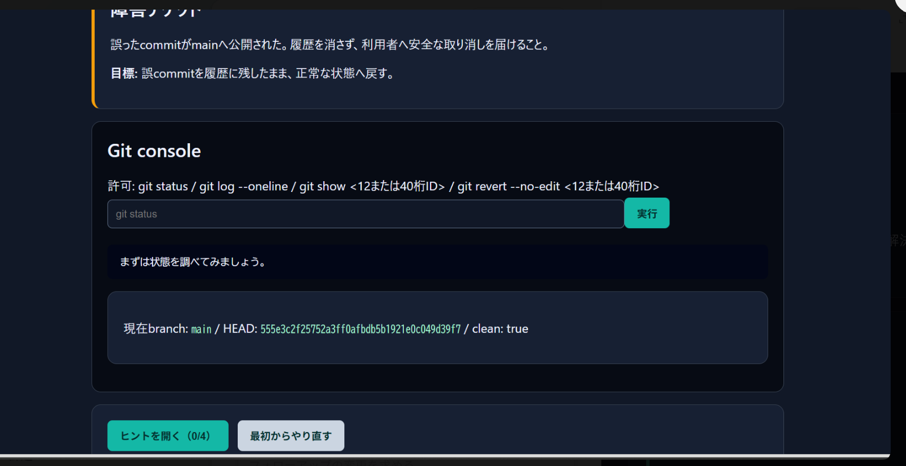
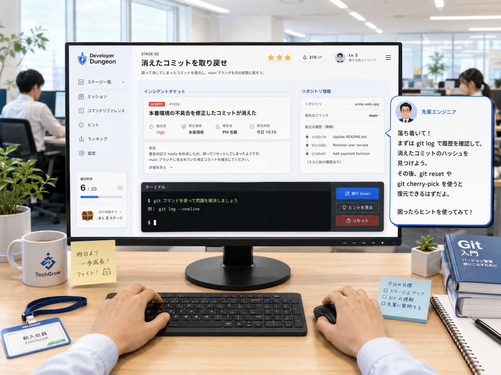
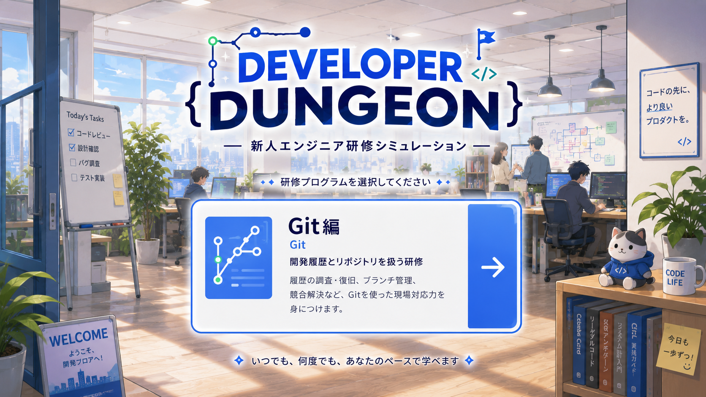
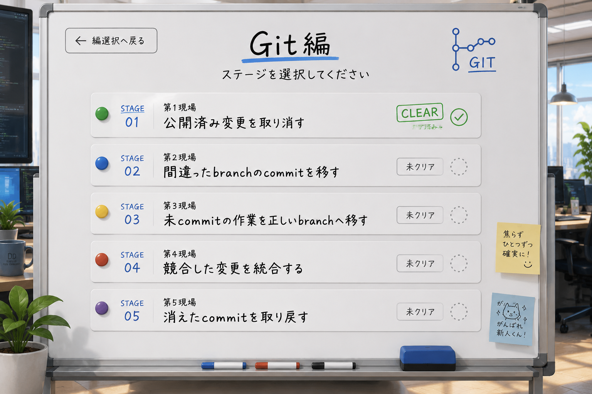

# Developer Dungeon ゲーム設計

## 文書情報

- 状態: 既存ベースラインは承認・実装済み。Phase 5改善単位7A・7B・7Cは実装前方針確定、未実装
- 上位文書: [`requirements.md`](requirements.md)
- 関連文書: [`git-mvp-stages.md`](git-mvp-stages.md)、[`vertical-slice.md`](vertical-slice.md)、[`phase-5-experience-improvement-plan.md`](phase-5-experience-improvement-plan.md)

## 1. この文書が決めること

この文書は、Developer Dungeonの世界観、主人公の成長、ステージの見せ方、ゲームループ、ヒント、難易度、3スター評価を定める。

この文書では、Git fixtureの厳密な状態、Javaクラス、DB、Docker構成を決めない。

## 2. ゲームコンセプト

Developer Dungeonは、教材を順番に読むゲームではない。架空のIT企業へ入社した新人エンジニアである主人公が、研修、仮配属、チーム開発、障害対応を通じて、技術、判断力、周囲からの信頼を獲得していく実践型の学習ゲームである。現在のMVPは、複数のGit事故を調査し、実際のGitコマンドで復旧する事故対応編を提供する。

ゲームとしての面白さは、次の3つから作る。

1. 何が起きたかをログとリポジトリ状態から推理する。
2. 複数のGit操作から、現場条件に合う安全な方法を選ぶ。
3. 復旧結果によって、登場人物の反応と主人公の立場が変化する。

## 3. 世界観

### 3.1 舞台

舞台は現代的な架空の開発会社である。会社名と製品名は未確定とし、実在する企業、人物、顧客、リポジトリは使用しない。この会社固有の研修と開発文化として描き、一般的なIT企業や新卒研修の標準例であるかのように表現しない。

主人公は入社したばかりの新人エンジニアで、1つの主力サービスを支える複数のサブシステムとチームを経験する。設定、通知、検索、プロフィール、決済などの領域を横断することで、同じ利用者とサービスへの継続的な責任を感じながら、異なるチーム文化、納期、品質問題に向き合う。1つのリポジトリや固定された組織構造へは限定しない。

「ダンジョン」はGit用語の代替ではなく、複雑な現場とリポジトリを攻略していく比喩としてUIと章立てに利用する。

### 3.2 継続する人物関係

| 役割 | 物語上の機能 |
|---|---|
| 主人公 | プレイヤーの判断を実行し、失敗と成功を通じて成長する新人 |
| 指導役の先輩 | 正解を直接言わず、確認すべき観点と現場上の制約を示す |
| 同期 | プレイヤーと近い視点から疑問や別案を提示する |
| QA担当 | 履歴だけでなく、最終成果物と再現性を重視する |
| 運用担当 | 公開済み履歴、リリース、復旧時間などの制約を提示する |
| 各現場の責任者 | ステージ固有の背景と利害を提示する |

登場人物は講師役だけにせず、意見の違い、焦り、誤解、信頼回復を持たせる。ただし、物語の分岐によって技術上の正解が変わる仕組みはMVPに含めない。

### 3.3 共通章構成と主人公の責任拡大

将来の全編は、同じ会社、主力サービス、主要人物の中で、主人公の判断権と任される成果物が段階的に増える構造とする。ゲーム内の章順と実装順は分けてよく、現在のMVPとPhase 5を完了してから各章を個別設計する。

| 章 | 物語上の位置づけ | 主人公が決めること | 状態 |
|---|---|---|---|
| Chapter 0 日常開発フロー | 新人研修から仮配属まで | 何を確認し、何をcommitへ含めるか | 将来構想。初心者推奨・経験者はスキップ可能。3ステージ・20〜40分を暫定規模とする |
| Chapter 1 Git事故対応 | 現在の`STAGE-GIT-01`〜`05` | 証拠から安全な復旧方法を選び、根拠を説明する | 現行MVPとして実装済み |
| Chapter 2 remote共同作業 | 他者と共有する開発への参加 | 更新の取得、統合、共有の順序を提案する | Phase 5後に個別評価する将来構想 |
| Git編Finale | 複合インシデントへの対応 | 問題を分解し、復旧順序と確認方法を関係者へ示す | Chapter 2後に個別評価する将来構想 |
| 将来技術編 | コードレビュー、SQL、Docker・CI/CD、運用 | 技術領域をまたいで調査し、再発防止を合意する | Git編検証後に編ごとに再評価する |
| 全編の到達点 | 後輩を支援する立場 | 正解を教えるだけでなく、確認事項と安全な根拠を問い返す | 長期的なキャラクターアーク |

Chapter 0は文章中心の講義にせず、小さな業務上の問題を実際の操作で解決する任意の導入章とする。暫定候補は、最初の変更を確認してcommitする課題、不要な生成物をstage対象から外して`.gitignore`を設定する課題、作業branchを作成して簡単なレビュー指摘を直す課題の3件である。これは実装仕様ではなく、許可操作、fixture、採点、画面導線を含む確定設計はPhase 5後に行う。

主人公は章が進むほど、指示された操作を実行する立場から、確認対象、復旧方針、関係者との調整、再発防止を自分で提案する立場へ移る。先輩は正解を告げず制約を示し、同期は事故原因役へ固定せず、ときには主人公より先に異常へ気づく有能な仲間として扱う。

## 4. 教育ソフト的な味気なさを避ける原則

- 問題文を「次のコマンドを答えよ」にしない。
- 現場で何が起き、誰が困り、何を壊してはいけないかを先に示す。
- マスコットが長い講義をしてから問題を解かせる形式にしない。
- Gitの標準出力は加工しすぎず、演出と別領域に表示する。
- 失敗時に不正解音だけを出さず、状態がどう変わったかを示す。
- クリア後は技術解説だけでなく、人物関係または主人公の立場を1つ進める。
- 1ステージの物語は短くし、再挑戦時にはスキップできるようにする。
- 派手な演出のために実際のGit挙動を変えない。
- 初心者向け導入でも用語の順次講義にせず、守る対象と小さな問題を先に示す。
- 主人公の成長を先輩の称賛だけで表さず、作業メモ、復旧根拠、引継ぎ、レビュー、調査報告など、任される成果物の変化で示す。

## 5. 基本ゲームループ

1. **導入**: 短い会話と、中央headerへ統合した障害説明・現場の制約を読む。
2. **目標確認**: 技術目標と守るべき条件を確認する。
3. **診断**: `status`、`log`、`diff`などで状態を調べる。
4. **仮説**: 何が壊れているか、どの操作が安全かを考える。
5. **実操作**: 許可されたGitコマンドを入力する。
6. **フィードバック**: Git出力と現在状態の要約を確認する。
7. **自動判定**: repository snapshotを使ってクリア条件を確認し、成立時はworkspaceを破棄してクリアを確定する。
8. **自己確認**: 最終snapshotから作成した状態要約を読み、何を確認できたから復旧完了と言えるかを考え、その後に固定解説を開く。clear後の追加Gitコマンドは要求しない。
9. **振り返り**: 修復前後、安全な理由、危険な代替案を確認する。
10. **物語結果**: 登場人物の反応と主人公の成長を見る。

安定版MVPでは現在の自動クリアを維持する。自己確認はクリア後の非採点・非永続な振り返りであり、プレイヤーがライブworkspaceの完了を宣言する「復旧報告」ではない。復旧報告は、attempt lifecycle、TTL、cleanupを含む別設計としてMVP後に必要性を再評価する。

## 6. ステージ画面の情報構成

active中の主要なプレイ画面は、次の4領域を基本とする。

1. ステージ一覧、ミッション、コマンド、ヒントのsidebar
2. 障害説明、技術目標、守るべき条件を統合した中央header
3. 現在branch、HEAD、clean状態、操作途中状態の読み取り専用repository領域
4. command入力、実行、Gitの標準出力・標準エラーを置くworkspace

Stage 4の限定editorはmerge conflict中だけworkspaceへ追加する。hintはsidebar内で必要な段階だけ展開し、command参照は番号、command、用途の3列表へ移動する。独立した障害ticket、重複導入文、active中の証拠選択カード、常時概念chip、main領域下部のhint cardは置かない。リセットは補助操作、自動判定後の自己確認と振り返りはclear終端表示として維持する。

完全なGitグラフGUIやドラッグ操作はMVPに含めない。必要な視覚補助は、実際のコマンド操作を置き換えない読み取り専用情報に限定する。

### 6.1 採用する視覚構成

Phase 5の手動確認で、現状の全面的な暗色UIは、日中のIT企業で働く新人エンジニアという世界観よりも、暗い部屋でターミナルを操作するハッカーの印象を強く与えることが確認された。以後のUI改善では、次の一人称オフィス構成を目標として採用する。

- 主人公の一人称視点で、明るい日中のオフィス、机、観葉植物、周囲で働く人物を固定背景として表示する。
- 画面中央のPCモニター内に、sidebar、統合header、repository情報、workspaceを配置する。
- 先輩、同期、QA担当、運用担当などの会話は、PC画面外に人物アイコン付きの吹き出しとして表示する。
- ターミナル部分は暗色のままでもよいが、暗色をゲーム画面全体の基調にはしない。
- ステージ開始時は、スキップ可能な短い会話から統合headerと操作画面へ移る。
- クリア時はコマンド入力を閉じ、PC画面内に大きな完了表示を出し、PC画面外の人物の反応へつなげる。
- 狭い画面ではオフィス背景を一部省略し、PC画面をほぼ全画面にする。会話吹き出しは画面下部のパネルへ切り替える。
- default表示は承認済み画像程度の白いmonitorサイズを基準とし、viewport不足時は手、keyboard、周辺小物から先にcropまたは省略する。

次の比較画像を、今後の画面設計と実装レビューで参照する。目標画像の一人称構図、明るさ、PC画面と会話領域の分離、情報の階層は、可能な限り維持する。画像全体を1枚の背景として操作画面にするのではなく、PC画面と吹き出しはHTMLとして操作可能に実装する。

<table>
  <thead>
    <tr>
      <th>現状のUI</th>
      <th>採用する目標UI</th>
    </tr>
  </thead>
  <tbody>
    <tr>
      <td></td>
      <td></td>
    </tr>
  </tbody>
</table>

[現状UIを原寸で表示](assets/ui/current-stage-command-ui.png) / [目標UIを原寸で表示](assets/ui/target-first-person-office-ui.png)

目標画像内の文章、コマンド、メニュー名、スター、XP、ランキングなどは確定仕様ではない。特に人物の通常会話では正解コマンドを先に教えず、状況、守るべき条件、確認観点だけを伝える。具体的な構文と対象は段階ヒントへ分離する。背景は当面1種類の固定画像でよく、複数背景、人物の全身イラスト、アニメーション、BGMは別途承認するまで実装対象にしない。

### 6.2 タイトル画面とGit編ステージ選択画面

具体的なStageへ入る前に、次の2画面を設ける。

1. `/`のタイトル兼編選択画面で研修プログラムを選ぶ。
2. `/git/stages`のGit編ステージ選択画面でSTAGE-GIT-01〜05を選ぶ。

タイトル画面は明るい日中のオフィスを背景に、作品名、短い説明、利用可能なGit編カードを中心へ置く。将来別編を追加できる余白は視覚構成として確保してよいが、安定版MVPではGit編だけを表示し、Java、SQL、Docker編の無効card、汎用編管理、共通Runner基盤を先行実装しない。

Git編ステージ選択画面はホワイトボードを基調とし、各Stageの番号、現場番号、題名、clear／未clear状態だけを学習順に表示する。最高スター、XP、ランキング、細かな説明文は表示しない。スター情報は既存の採点と永続化から削除せず、Stage内の結果や将来の振り返りに利用できる状態を維持する。全Stageは従来どおり直接選択でき、未clear Stageをlockしない。

次の2画像を入口画面の正式な設計参照とする。画像内の細かな文言、架空ロゴ、装飾はpixel単位の実装要件ではないが、明るさ、中央の選択対象、情報量、ホワイトボード型の行構成は可能な限り維持する。

<table>
  <thead>
    <tr>
      <th>タイトル兼編選択画面</th>
      <th>Git編ステージ選択画面</th>
    </tr>
  </thead>
  <tbody>
    <tr>
      <td></td>
      <td></td>
    </tr>
  </tbody>
</table>

[タイトル画面を原寸で表示](assets/ui/target-title-edition-selection.png) / [ステージ選択画面を原寸で表示](assets/ui/target-git-stage-selection.png)

画像は設計参照として使用し、画面全体を1枚の画像や透明なclick領域として実装しない。見出し、カード、戻る導線、Stage行、clear状態はsemantic HTMLとCSSで構成し、keyboard操作、focus表示、読み上げ、狭い画面での再配置を維持する。手書き風の表現は可読性を優先し、外部font配信への依存を必須にしない。

## 7. ヒント設計

| レベル | 内容 | 2スターへの影響 |
|---|---|---|
| 1: 観察 | どの状態やログを見るべきかを示す | 影響なし |
| 2: 概念 | revert、stashなどの考え方を説明する | 影響なし |
| 3: 形式 | コマンドの形をプレースホルダー付きで示す | 2スター不可 |
| 4: 解法 | 対象refを含む具体的な手順を示す | 2スター不可 |

ヒントは順番に開示し、未開示の内容を先に見せない。ヒント使用を恥や失敗として扱わず、1スターのクリアは常に正規の達成とする。

内部パイロットでは、Stage 1・2を含む正確な許可構文の常時表示が、状態を理解せず候補を総当たりする余地を作ると確認された。以後は全5ステージを`CONCEPT_ONLY`へ統一し、常時表示は「状態確認」「履歴確認」「差分確認」「復旧」のような概念カテゴリだけにする。正確な構文はヒントレベル3、対象を含む具体手順はヒントレベル4で開示する。server側のcommand allowlistとtyped command検証は変更しない。

案内量と読み取り専用状態要約は別機能として維持する。Stage 5は`CONCEPT_ONLY + REDACTED_BRANCHES`とし、状態要約は`main`が存在し復旧対象branchが存在しないことだけを示す。reflog entry、object ID、正解commandは状態要約へ出さない。新しい汎用feature flagや動的設定は追加しない。

## 8. 3スター評価

- **1スター: 復旧完了** — 最終状態を満たした。
- **2スター: 自力判断** — 1スターに加え、ヒントレベル3・4を使っていない。
- **3スター: 安定対応** — 2スターに加え、プレイヤーが明示的なリセットを使っていない。

時間とコマンド数は評価しない。調査コマンドを減らすことは実務上の安全性と相反するためである。

具体的ヒントを使わずプレイヤーがリセットした場合は2スター、具体的ヒントを使ってリセットしなかった場合は1スターとなる。Runner障害、timeout、応答不明などのsystem recoveryはスターへ影響させない。各ステージの最高記録を保存する。

クリア後の自己確認はスターへ影響させず、回答を保存しない。リセットのスター条件はPhase 5でプレイヤーの試行錯誤を妨げているか確認するまで変更しない。

## 9. 失敗とリセット

失敗は次の4種類に分けて表示する。

1. **入力拒否**: 許可されていない構文、操作、引数。
2. **Gitエラー**: Gitが通常返す競合、dirty、存在しないrefなど。
3. **実行制限**: timeout、出力上限、workspace上限。
4. **システム障害**: Runner、Docker、管理DBなどの利用不能。

入力拒否ではGitを実行せず、同じworkspace、generation、repository状態を維持する。Gitエラーは学習材料として出力を表示し、Gitが実際に残した状態を同じworkspaceで維持する。入力拒否と通常Gitエラーを理由に、正しかった過去操作を失う自動rollbackやworkspace再生成を行わない。リセットはプレイヤーが明示した場合に、attemptの記録を残したままworkspaceを破棄して再生成する。

リセット後も同じ論理attemptを継続し、開示済みの最高hint level、player reset回数、system recovery回数、command履歴を保持する。プレイヤー操作のリセットで3スター条件を回復させない一方、system recoveryは減点しない。ステージ一覧から明示的に「新しい挑戦」を開始した場合だけ、別attemptとして評価を0から始める。

## 10. 難易度

### 研修

- 1つの主要概念に集中する。
- 守るべき条件を明示する。
- 調査コマンドの候補が少ない。
- `STAGE-GIT-01`を該当させる。

### 実務

- 複数のbranch、index、working tree、履歴を観察する。
- 危険な近似解が存在する。
- `STAGE-GIT-02`から`STAGE-GIT-05`を該当させる。
- 初見プレイでは診断、仮説、復旧、確認の4段階を体験できる情報と判断を用意する。
- 確認は自動clear後の最終状態要約と自己確認で行い、clear後の追加Gitコマンドを前提にしない。
- 操作量は、新しい証拠によって仮説または次の判断が変わる意味のあるbeatで比較する。会話送り、画面遷移、既知情報の再表示、自動feedbackは数えない。
- コマンドを増やす場合は、新しい証拠を得る、危険な操作を避ける、または復旧方針を選ぶ役割を必要とする。固定コマンド数、最短手順、調査回数を採点しない。

### 修羅場

- rebase、bisect、remote、複数事故などを扱う。
- MVP後に個別ステージとして追加する。
- 自動難易度調整や同一ステージのランダム生成は行わない。

## 11. Git編 Chapter 1「事故対応」（現行シーズン1）

| ステージ | 現場上の出来事 | 主な関係者 | Git学習 | 主人公の成長 |
|---|---|---|---|---|
| STAGE-GIT-01 | 公開済みの誤変更が発覚する | 運用担当、先輩 | revert | 履歴を守る判断を初めて任される |
| STAGE-GIT-02 | コミット先のbranchを間違える | QA担当、先輩 | cherry-pick / local reset | branch位置の安全性を説明する |
| STAGE-GIT-03 | mainで始めた作業をfeatureへ移す | 同期、先輩 | stash | 作業を失わず整理し、次の段取りを任される |
| STAGE-GIT-04 | 別チームの変更と衝突する | QA担当、二つのチーム、先輩 | merge conflict | 他者の意図を統合し、関係者へ説明する |
| STAGE-GIT-05 | 削除したbranchの作業が消えたように見える | 同期、運用担当、先輩 | reflog | 証拠から失われた作業を回収し、インシデント全体を説明する |

最終ステージ後、主人公は「指示されたコマンドを打つ新人」から「状態を説明し、安全な復旧方法を提案できる担当者」へ進む。先輩は次のインシデント説明を主人公へ任せ、シーズン1を「復旧操作ができた」だけでなく「根拠を示して周囲を動かせるようになった」成長で締める。

将来Chapter 0を追加する場合も、Stage 1〜5の事故内容、技術目標、採点、安全境界、成長beatは維持する。接続は、Chapter 0終了時の事故連絡、Stage 1を仮配属初日の判断とする短い導入、Stage 5終了時のremote共同作業への伏線に限定し、具体的な文章はPhase 5後に決定する。

各ステージのresourceには、最低限次を含める。

- 操作前の固定導入scene
- クリア時の固定clear scene
- そのステージでの主人公の成長beat
- 技術振り返り

スター別の短い反応差分は任意とし、MVP必須の分岐systemにはしない。会話をskipしても技術条件と振り返りを確認できるようにする。

## 12. 将来シーズンとの接続

- Javaコードレビュー編: 指摘を受ける側から、他者の意図を尊重しながら根拠を示して改善を提案する側へ進む。読みにくい変更、例外処理、テスト不足、設計上の欠陥を扱う。
- SQL編: 与えられたSQLを実行するだけでなく、症状から仮説を立て、架空の業務データを壊さず不整合の原因を特定し、調査報告を作る。
- Docker・CI/CD障害対応編: 起動失敗、health check、network、volume、buildやdeployの失敗を調査し、運用担当と復旧手順と再発防止を合意する。

共通利用するのは、世界観、登場人物の役割、主力サービス、チケット形式、調査・実行・確認・振り返りのゲームループ、主人公の責任拡大である。現在のコード、DB、Runnerには将来シーズン用の共通化を入れず、2つ目以降の学習編を実装した後に実績から再評価する。

## 13. 未確定事項

- 主人公、先輩、同期、会社、各プロジェクトの正式名称
- 目標UI画像をHTML/CSSへ落とし込む際の細かな余白、文字サイズ、PC画面の占有率
- 会話の文体、主人公の性格、固定名か名前入力か
- MVP検証で物語スキップ率や会話量をどう評価するか
- Chapter 0の確定ステージ数、各課題、スキップ導線、実装順
- Chapter 2、Git編Finale、将来技術編の具体的なシナリオ、技術境界、章順
- 主力サービスのサブシステム、チーム、リポジトリの具体的な構成

未確定事項は文章制作または画面デザインへ着手する前にユーザーと決定する。
