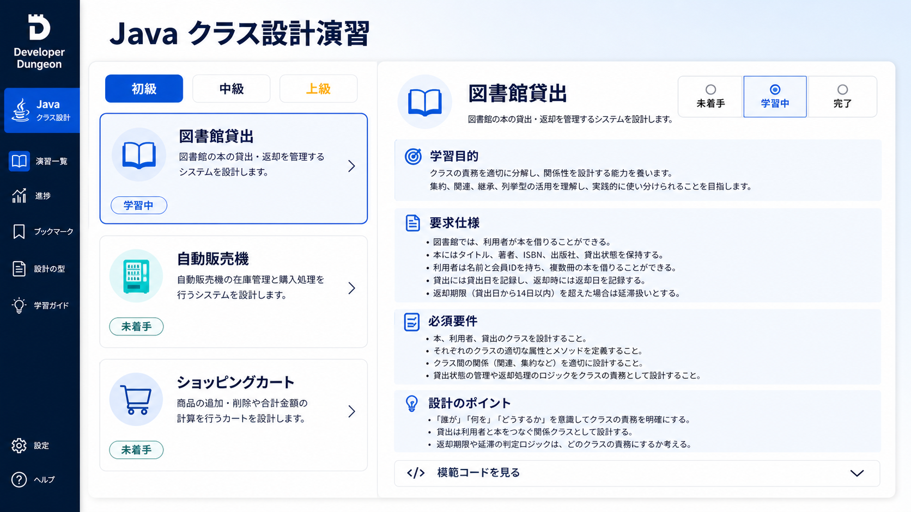

# Javaクラス設計問題集 MVP仕様

## UI実装リファレンス

一覧・詳細画面は、暗いゲーム端末ではなく、長い仕様とJava codeを読みやすい本格的な演習サイトとして設計する。紺色のナビゲーション、白い本文面、青・シアンのアクセント、十分な余白と見出し階層を基調とする。



## 文書情報

- 状態: MVP実装済み。井上の実装後レビューPASS、対象限定テスト済み
- 対象: Javaクラス設計問題集MVPの9問、コンテンツ構造、画面、進捗、模範code、テスト境界
- 上位文書: [`requirements.md`](requirements.md)
- 関連文書: [`architecture.md`](architecture.md)、[`test-strategy.md`](test-strategy.md)、[`../roadmap.md`](../roadmap.md)

## 1. この文書が決めること

この文書は、Javaクラス設計問題集MVPの3テーマ×3難易度、各問題で要求する設計判断、初級の数指定、問題コンテンツの管理形式、画面と進捗の責務、模範codeの品質、実装時のテスト境界を定める正本である。

Java問題集はDeveloper Dungeonの上位ブランドと編選択画面を共有するが、Git編のStage、事故対応の物語、Runner、workspace、状態採点、スターを使用しない。利用者codeの採点・保存・サイト内実行・ChatGPT API連携はこのシステムの責務に含めない。全問題にlocalで行う`Main`動作確認scenarioと、教材側が管理する模範`Main.java`を用意する。

## 2. 共通方針

### 2.1 学習対象

- Java入門書を終え、class、constructor、field、method、collection、exceptionの基本文法を学習済みの利用者を対象とする。
- `main` method内の処理手順やアルゴリズムではなく、要求を複数のclassと責務へ分割する力を扱う。
- JDK 25を前提とし、preview機能と外部libraryを使用しない。
- 初級では具体的な設計枠を与え、中級では責務分割を利用者へ委ね、上級では状態遷移、拡張点、不変条件を含める。
- 同じテーマの各級は独立問題とし、前の級のsource codeを引き継がなくても解ける。
- 9問は最初からすべて選択可能とし、unlockを設けない。

### 2.2 用語と数え方

初級問題の数指定は、次の規則で数える。

- `class数`: 問題で作成を要求するtop-level class、interface、enumの総数。MVPの初級ではclassだけを要求する。
- `メンバ変数数`: 各classへ宣言するinstance fieldの数。問題文で指定しない`static final`定数や追加fieldを勝手に増やさない。
- `メソッド数`: constructorを除く、問題文で指定する各classのdomain API数。getterと状態確認methodを含み、動作確認用`Main`のmethodと実装上のprivate helperは数へ含めない。
- `constructor数`: method数とは別に示す。初級MVPでは各classにconstructorを1つ要求する。
- `Object`由来method: `equals`、`hashCode`、`toString`は、問題文で明示しない限り数へ含めず実装も要求しない。
- method overloadは宣言1つごとに1methodとして数える。
- 動作確認用の`Main` classと`main` methodは、class数、constructor数、field数、method数のすべてから除外する。

初級ではclass名、fieldの型と目的、methodの引数・戻り値・目的まで示す。利用者が考える中心は、指定された状態をどのclassが守り、method同士がどう協調して不正状態を防ぐかである。

### 2.3 模範code

- 各問題に模範実装を1案だけ用意する。
- 1案は1fileを意味しない。複数classが必要な問題では、複数の`.java` fileをまとめた1つの一貫した実装を指す。
- sourceはJDK 25、preview機能なし、外部libraryなしでcompileできる。
- 1問題内のsourceは一貫した固有packageへ置き、`public` typeとfile名を一致させる。問題ごとに別の出力directoryへcompileし、他問題のclassへ暗黙に依存させない。
- reference sourceのpackageは`jp.yuya.dev.developerdungeon.javaproblems.<slugのハイフンをドットへ置換した値>`に固定する。たとえば`library-beginner`は`jp.yuya.dev.developerdungeon.javaproblems.library.beginner`とする。
- 断片、疑似code、未実装method、`TODO`を含めない。
- 問題の必須要件と不変条件をすべて満たす。
- fieldを原則`private`にし、mutable collectionをそのまま外へ返さず、constructorとdomain methodで不正状態を防ぐ。
- getterとsetterだけの貧血modelへせず、状態を変える規則を責務を持つclassへ置く。
- 中級・上級では、模範codeと異なるclass構成も妥当になり得る。模範codeは唯一解または自動採点基準として扱わない。
- 問題画面では最初は閉じた折りたたみとして表示し、利用者が選んだ場合だけ展開する。
- 問題集は利用者codeと模範codeを比較・採点しない。

## 3. MVPカリキュラム

### 3.1 一覧

| 表示順 | key | テーマ | 難易度 | 問題タイトル | 主な学習要素 |
|---:|---|---|---|---|---|
| 1 | `JAVA-LIBRARY-BEGINNER` | 図書館貸出 | 初級 | 1冊の本を1人へ貸し出す | encapsulation、2classの協調 |
| 2 | `JAVA-VENDING-BEGINNER` | 自動販売機 | 初級 | 1種類の商品を販売する | 状態、金額、在庫、不正操作 |
| 3 | `JAVA-CART-BEGINNER` | ショッピングカート | 初級 | 商品をカートへ追加して合計する | composition、List、集計 |
| 4 | `JAVA-LIBRARY-INTERMEDIATE` | 図書館貸出 | 中級 | 複数蔵書と貸出記録を管理する | 責務分割、collection、貸出規則 |
| 5 | `JAVA-VENDING-INTERMEDIATE` | 自動販売機 | 中級 | 複数スロットと購入結果を管理する | value、失敗時不変、取引結果 |
| 6 | `JAVA-CART-INTERMEDIATE` | ショッピングカート | 中級 | 在庫を確認して注文を確定する | aggregate、snapshot、checkout |
| 7 | `JAVA-LIBRARY-ADVANCED` | 図書館貸出 | 上級 | 予約・延長・貸出方針を設計する | policy、Clock、待ち行列、状態遷移 |
| 8 | `JAVA-VENDING-ADVANCED` | 自動販売機 | 上級 | 支払い方式と販売取引を分離する | interface、polymorphism、transaction状態 |
| 9 | `JAVA-CART-ADVANCED` | ショッピングカート | 上級 | 割引・在庫予約・注文状態を統合する | value object、policy、整合性、取消 |

問題一覧は初級、中級、上級の順に3区画へ分け、各区画内を図書館貸出、自動販売機、ショッピングカートの順とする。

## 4. 初級3問

### 4.1 `JAVA-LIBRARY-BEGINNER` 1冊の本を1人へ貸し出す

#### 学習目的

- 1つのclassへ状態とその状態を守るmethodをまとめる。
- `Book`と`LibraryMember`を協調させ、貸出状態を片方だけ変更しない。
- すでに貸出中の本、すでに本を借りている利用者への不正操作を防ぐ。

#### 指定するclass

class数は2、各classのconstructorは1つとする。

| class | 目的 | field数 | fieldと目的 | method数 | methodと目的 |
|---|---|---:|---|---:|---|
| `Book` | 1冊の本の識別情報と貸出状態を保持する | 3 | `id:String`=本の識別子、`title:String`=題名、`borrowed:boolean`=貸出中か | 5 | 識別子取得、題名取得、貸出中判定、貸出状態へ変更、返却済み状態へ変更 |
| `LibraryMember` | 1人の利用者と現在借りている1冊を管理する | 3 | `id:String`=利用者識別子、`name:String`=氏名、`borrowedBook:Book`=現在借りている本または未貸出を表す`null` | 5 | 識別子取得、氏名取得、借入中判定、指定本を借りる、現在の本を返す |

#### 必須要件

- blankの識別子と題名・氏名をconstructorで拒否する。
- 貸出中の`Book`を再度貸し出さない。
- `LibraryMember`は同時に1冊だけ借りられる。
- 借りる操作が成功した場合だけ、`Book`と`LibraryMember`の両方を更新する。
- 返す操作が成功した場合だけ、両方を未貸出状態へ戻す。
- 不正操作では`IllegalStateException`または`IllegalArgumentException`を使用し、途中状態を残さない。

#### 設計時に考えるポイント

- `borrowed`を外部から自由に変更できない理由。
- 利用者だけ、本だけを更新した場合に生じる矛盾。
- `borrowBook`と`returnBook`のどちらが協調処理を開始する責務を持つか。

### 4.2 `JAVA-VENDING-BEGINNER` 1種類の商品を販売する

#### 学習目的

- 在庫、投入金額、商品価格を別の状態として管理する。
- 購入可能条件をdomain methodへ閉じ込める。
- 購入失敗時に在庫や投入金額を変えない。

#### 指定するclass

class数は2、各classのconstructorは1つとする。

| class | 目的 | field数 | fieldと目的 | method数 | methodと目的 |
|---|---|---:|---|---:|---|
| `Product` | 販売する商品の名称と価格を保持する | 2 | `name:String`=商品名、`priceYen:int`=1個の税込価格 | 2 | 商品名取得、価格取得 |
| `VendingMachine` | 1種類の商品の在庫と利用者の投入金額を管理する | 3 | `product:Product`=販売商品、`stock:int`=在庫数、`insertedYen:int`=現在の投入金額 | 6 | 在庫取得、投入金額取得、金額投入、購入可能判定、1個購入、残額返金 |

#### 必須要件

- 商品価格は1円以上、初期在庫は0以上とする。
- 投入額は1円以上だけ受け付ける。
- 在庫0または投入金額不足では購入できず、状態を変更しない。
- 購入成功時は在庫を1減らし、投入金額から価格を引き、購入した`Product`を返す。
- 価格を超えた残額は機械内へ保持し、返金操作は残額を返して0へ戻す。
- 負数の在庫、投入金額、価格を作らない。

#### 設計時に考えるポイント

- `canPurchase`と`purchase`で条件が食い違わない方法。
- 購入失敗後も状態が変わらないことの重要性。
- 商品価格を`VendingMachine`へ重複保持しない理由。

### 4.3 `JAVA-CART-BEGINNER` 商品をカートへ追加して合計する

#### 学習目的

- `Product`、`CartItem`、`ShoppingCart`をcompositionで組み合わせる。
- collectionへ格納する要素と、collection全体を管理する責務を分ける。
- 同一商品を追加したときに行を重複させず数量へ反映する。

#### 指定するclass

class数は3、各classのconstructorは1つとする。

| class | 目的 | field数 | fieldと目的 | method数 | methodと目的 |
|---|---|---:|---|---:|---|
| `Product` | 商品識別子、名称、単価を保持する | 3 | `id:String`=商品識別子、`name:String`=商品名、`unitPriceYen:int`=1個の税込価格 | 3 | 識別子取得、名称取得、単価取得 |
| `CartItem` | 1商品の数量と小計を管理する | 2 | `product:Product`=対象商品、`quantity:int`=数量 | 4 | 商品取得、数量取得、数量追加、小計計算 |
| `ShoppingCart` | 複数の`CartItem`を保持してカート全体を管理する | 1 | `items:List<CartItem>`=カート内の商品行 | 5 | 要素もcopyした読み取り用snapshot取得、商品追加、全数量取得、合計金額計算、全削除 |

#### 必須要件

- 商品単価と追加数量は1以上とする。
- 同じ`Product.id`の商品を再度追加した場合は既存`CartItem`の数量を増やす。
- 小計は単価×数量、合計は全小計の合計とする。
- 外部から`items`を直接追加・削除できず、取得した`CartItem`の数量変更も内部へ影響しないsnapshotを返す。
- `clear`後は数量と合計が0になる。
- 金額はMVPでは`int`の円単位とし、税、割引、送料を扱わない。

#### 設計時に考えるポイント

- `ShoppingCart`へ商品・数量・小計を平行Listで持たせない理由。
- 同一商品判定をobject identityではなく商品識別子で行う理由。
- mutableな`List`をそのまま返す危険性。

## 5. 中級3問

中級ではclass数、field数、method数、class名を固定しない。必須要件を満たす責務分割を利用者が設計する。

### 5.1 `JAVA-LIBRARY-INTERMEDIATE` 複数蔵書と貸出記録を管理する

#### 学習目的

- 書誌情報と物理的な蔵書を分ける。
- 利用者、蔵書、貸出記録、全体操作の責務を分ける。
- collection全体の整合性を守るapplication/domain serviceを設計する。

#### 必須要件

- 同じISBNの本を複数冊所蔵でき、各冊をcopy IDで識別する。
- 利用者は同時に最大3冊まで借りられる。
- 貸出時に利用者、蔵書copy、貸出日、返却期限を持つ貸出記録を作る。
- 返却期限は貸出日の14日後とする。
- 貸出中copyの再貸出、上限超過、存在しない利用者・copyを拒否する。
- 返却者と貸出記録の利用者が一致する場合だけ返却できる。
- 返却済み記録を履歴として残し、open中の貸出と区別する。
- ISBN別の利用可能冊数と、利用者別のopen貸出を確認できる。
- 不正操作が失敗しても蔵書状態と貸出記録を部分更新しない。

#### 任意の発展要件

- タイトルまたはISBNによる検索。
- 貸出上限を固定値ではなく方針classへ分離する。

#### 設計時に考えるポイント

- 本の題名と「貸し出せる1冊」を同じclassで表す限界。
- 利用者と蔵書copyの双方へ貸出情報を重複保持するか、貸出記録を正本にするか。
- 返却済み履歴をmutableな貸出中状態とどう区別するか。

### 5.2 `JAVA-VENDING-INTERMEDIATE` 複数スロットと購入結果を管理する

#### 学習目的

- 商品種類、販売スロット、投入残高、購入結果を別の概念として設計する。
- 成功と失敗を呼び出し側が扱える結果modelを考える。
- 複数状態を更新する操作でall-or-nothingを守る。

#### 必須要件

- `A1`のようなslot codeごとに商品、現在価格、在庫を管理する。
- 同じ商品を複数slotへ置ける。
- 利用者は正の金額を複数回投入できる。
- 購入時はslotの存在、在庫、投入残高を検証する。
- 成功時は商品、購入価格、返却すべき残額を持つ購入結果を返し、在庫を1減らして投入残高を0へ戻す。
- 失敗時は理由を区別し、在庫と投入残高を変更しない。
- 返金では現在残高を返して0へ戻す。
- 累計売上を、投入総額ではなく成功した購入価格の合計として管理する。
- 金額は`int`円単位とし、硬貨の組合せ計算は扱わない。

#### 任意の発展要件

- slotの補充と価格変更。
- 売切れ商品の一覧。

#### 設計時に考えるポイント

- `null`、exception、result objectのどれで購入失敗を表現するか。
- 商品情報とslot固有価格をどこへ置くか。
- 状態変更より先にすべての条件を検証する理由。

### 5.3 `JAVA-CART-INTERMEDIATE` 在庫を確認して注文を確定する

#### 学習目的

- 編集中のcartと確定後のorderを別のaggregateとして扱う。
- checkout時点の商品名、単価、数量をsnapshotとして保持する。
- cart、inventory、order作成の協調を設計する。

#### 必須要件

- cartへ商品を追加し、数量変更と削除ができる。
- inventoryは商品ID別の利用可能数を管理する。
- 空cartはcheckoutできない。
- checkoutは全商品の在庫を先に確認し、1つでも不足する場合は在庫を減らさずorderも作らない。
- 成功時は全在庫を必要数だけ減らし、注文日時と注文行を持つorderを作る。
- order行はcheckout時の商品名、単価、数量、小計を保持し、後から商品価格が変わっても変化しない。
- checkout成功後は元cartを空にする。
- order合計はorder行の小計合計から計算する。
- 金額は`int`円単位とし、割引、決済、配送を扱わない。

#### 任意の発展要件

- cartの有効期限。
- 在庫不足の商品一覧をまとめて返す結果model。

#### 設計時に考えるポイント

- cart内の`Product`参照だけをorderへ引き継ぐ危険性。
- 在庫を順番に減らし、途中で不足が判明した場合の問題。
- checkout処理をcart、inventory、専用serviceのどこへ置くか。

## 6. 上級3問

上級ではclass数、field数、method数、具体的なclass名を固定しない。模範codeと異なる構成を許容し、必須の状態遷移、不変条件、拡張点を満たすことを重視する。

### 6.1 `JAVA-LIBRARY-ADVANCED` 予約・延長・貸出方針を設計する

#### 学習目的

- 貸出期間と上限をpolicyとして差し替える。
- 予約待ち行列、返却、延長を一貫した状態遷移として扱う。
- 現在日付への直接依存を避け、時間を外部から与える。

#### 必須要件

- 書誌、複数copy、利用者、貸出、予約を管理する。
- 標準会員と優先会員で貸出上限と貸出期間が異なる。
- 会員種別による規則を条件分岐の散在ではなく交換可能な貸出方針として表現する。
- 標準会員は最大3冊・14日、優先会員は最大5冊・21日の貸出方針を使用する。
- 利用可能copyの有無にかかわらず、ISBN単位のFIFO予約待ち行列へ登録できる。
- 同じ利用者による重複予約、すでに借りているISBNへの予約を拒否する。
- 未引当予約があるISBNの利用可能copyは、先頭の未引当予約者へ優先する。返却時も未引当の先頭予約者へ1予約につき1copyだけを引当済みにし、先頭予約者以外へ貸し出せない状態にする。引当済みcopyは一般の利用可能冊数に数えない。
- 引当済みcopyは先頭予約者だけが借りられる。貸出成功時に先頭予約を削除してcopyを貸出中にし、失敗時は引当状態と予約queueを変更しない。
- 貸出は1回だけ7日延長できる。ただし延滞中または未消費の次予約者がいる場合は延長できない。
- 現在日は`Clock`または同等の注入可能な時間sourceから取得する。
- 失敗した予約、貸出、返却、延長で一部状態だけを変更しない。

#### 任意の発展要件

- 予約取置き期限。
- 延滞日数に応じた貸出停止方針。

#### 設計時に考えるポイント

- 会員種別を継承で表すか、policyをcompositionするか。
- copyの`AVAILABLE`、`LOANED`、`RESERVED`をbooleanの組合せで表す危険性。
- 予約queueを外部へmutableなまま公開しない方法。

### 6.2 `JAVA-VENDING-ADVANCED` 支払い方式と販売取引を分離する

#### 学習目的

- 現金とcashlessの違いをinterfaceとpolymorphismで吸収する。
- 販売取引の状態を明示し、失敗時の在庫整合性を守る。
- 完了した販売記録を後から変化しないsnapshotにする。

#### 必須要件

- 複数slotの商品、価格、在庫を管理する。
- 現金支払いとcashless支払いの2方式を共通の支払い抽象で扱う。
- 現金は投入額と返金額を扱い、cashlessは外部決済の成功・失敗結果を受け取る。実network接続は行わない。
- 支払い承認後に内部処理が失敗した場合の承認取消と補償処理は、この問題では扱わない。
- 販売取引は少なくとも開始、支払い承認、完了、取消を区別する。
- slot確認、在庫確認、支払い承認のすべてが成功した場合だけ在庫を減らして販売を完了する。
- 支払い失敗または取消では在庫を減らさず、現金であれば返金額を確定する。
- 完了した販売記録は商品名、販売時価格、支払い方式、完了日時を保持し、後の価格変更で変化しない。
- 同じ取引を二重に完了または取消できない。
- 支払い方式固有の条件分岐を販売機本体へ散在させない。

#### 任意の発展要件

- 売上集計を支払い方式別に行う。
- 新しい支払い方式を1つ追加し、販売機側の変更量を確認する。

#### 設計時に考えるポイント

- 支払いを継承階層にするかinterface実装にするか。
- 在庫減算と支払い承認の順序。
- mutableな取引とimmutableな販売記録を分ける理由。

### 6.3 `JAVA-CART-ADVANCED` 割引・在庫予約・注文状態を統合する

#### 学習目的

- 金額をvalue objectとして扱う。
- 割引規則をpolicyとして交換可能にする。
- 在庫予約とorderの状態遷移を一貫させる。

#### 必須要件

- 金額は通貨をJPYに固定したimmutableなvalue objectで表現し、負数を作れない。
- cartは複数商品と数量を保持し、外部から内部collectionを変更できない。
- 複数の割引規則を共通interfaceで表現し、割引なし、固定額、割合の少なくとも3種類を扱う。
- 割合割引は`floor(小計 × 割引率 ÷ 100)`を割引額とする。
- 割引後合計を0未満にしない。
- checkout時に必要在庫を全件予約し、1件でも不足する場合は一切予約しない。
- orderは少なくとも支払い待ち、支払い済み、発送済み、取消済みを区別する。
- 支払い待ちorderだけを支払い済みまたは取消済みにできる。
- 支払い済みorderだけを発送済みにでき、発送後は取消できない。
- 取消は支払い待ちorderだけに許可し、取消時は予約在庫を戻す。支払い済みorderの取消と返金はMVPの対象外とする。
- order行、適用割引、合計はcheckout時のsnapshotとして後から変化しない。
- 不正な状態遷移と在庫不足では一部状態を変更しない。

#### 任意の発展要件

- 割引の併用可否を表す合成policy。
- 配送料policy。

#### 設計時に考えるポイント

- `int`と`Money` value objectの違い。
- checkout、在庫予約、order生成の調整責務をどこへ置くか。
- enumの状態だけでなく、許可される遷移をdomain methodで守る方法。

## 7. コンテンツ管理

### 7.1 resource構成

問題本文をControllerやJavaの`static`定義へハードコードしない。MVPでは次の固定resource構成とする。

```text
app/src/main/resources/java-problems/
  catalog.json
  library-beginner/
    problem.json
    reference/
      Book.java
      LibraryMember.java
  vending-beginner/
    problem.json
    reference/
      ...
  ...
```

- `catalog.json`を表示順とproblem directoryの唯一のmanifestとする。directory名はcatalogに固定値として記載し、slugやrequest値から組み立てない。
- `problem.json`は問題文、難易度、テーマ、要件、ヒント、初級指定、模範code file名を持つ。
- 模範codeはJSON文字列へ埋め込まず、複数の`.java` fileとして保存する。
- classpath directoryの自動列挙や任意path指定を行わず、manifestに記載した固定resourceだけを読む。
- Spring WebMVCが利用するJSON mapperを使用し、新しいMarkdown renderer、YAML parser、CMSを追加しない。
- problem本文は構造化したplain textとlistとして保持し、raw HTMLを許可しない。

### 7.2 problem model

`problem.json`は少なくとも次を持つ。

| field | 内容 |
|---|---|
| `key` | 変更しない内部識別子 |
| `slug` | URL用の固定識別子 |
| `theme` | `LIBRARY`、`VENDING_MACHINE`、`SHOPPING_CART` |
| `difficulty` | `BEGINNER`、`INTERMEDIATE`、`ADVANCED` |
| `order` | 1〜9の表示順 |
| `title` | 問題タイトル |
| `learningObjectives` | 学習目的 |
| `prerequisites` | 前提知識 |
| `requirements` | 要求仕様 |
| `constraints` | 実装条件 |
| `mandatoryRequirements` | 必須要件 |
| `optionalRequirements` | 任意の発展要件 |
| `designPoints` | 設計時に考えるポイント |
| `hints` | 必要時に展開するヒント。0件可 |
| `mainScenario` | `instances`、`steps`、`expectedResults`、`invariants`の4つの非空listからなるlocal動作確認scenario |
| `beginnerScaffold` | 初級だけ必須のclass・field・method・constructor数と目的 |
| `referenceFiles` | 1つの模範実装を構成する`.java` file名の順序付きlist |

`beginnerScaffold`は、class数とclassごとの目的、constructor数、field数・型・目的、method数・引数・戻り値・目的を持つ。中級・上級ではこのfieldを持たない。

### 7.3 起動時検証

固定resourceはapp起動時に全件を読み、次を満たさない場合は設定不備として起動を失敗させる。

- key、slug、orderが9問内で一意。
- key、slug、theme、difficulty、orderが許可形式内。
- 3テーマ×3難易度が各1問あり、合計9問。
- orderが1〜9で欠番・重複なし。
- 必須text/listが空でない。
- `mainScenario`を持ち、`instances`、`steps`、`expectedResults`、`invariants`の4 listがすべて空でない。
- 初級だけ`beginnerScaffold`を持ち、宣言数と要素数が一致する。
- 中級・上級がclass数を正解条件として持たない。
- `referenceFiles`が空でなく、同じproblem directory内の固定`.java` fileだけを指す。
- `referenceFiles`が`Main.java`をちょうど1件含み、そのfileが`public static void main(String[])`を宣言する。
- file名にseparator、`..`、absolute pathを含めない。
- reference fileが存在し、1file 64 KiB、1problem合計256 KiB以内。
- 各reference sourceが`jp.yuya.dev.developerdungeon.javaproblems.<slugのハイフンをドットへ置換した値>`だけをpackageとして宣言し、`public` typeとfile名が一致する。

固定contentの破損は開発・release時の欠陥であり、不完全なJava問題を黙って非表示にしない。Git編を含むapp全体を起動失敗させるため、release前のcontent検証testを必須とする。

## 8. 画面設計

### 8.1 route

| method | path | 役割 |
|---|---|---|
| GET | `/` | 現状はGit編とJava編の固定cardを表示する編選択。SQL編はSQL Phase 2で一覧routeが利用可能になる変更と同時に追加 |
| GET | `/java` | `/java/problems`へredirect |
| GET | `/java/problems` | 9問と進捗を初級・中級・上級別に表示 |
| GET | `/java/problems/{slug}` | 固定catalogから1問を表示 |
| POST | `/java/problems/{slug}/progress` | 未着手・学習中・完了を更新し、同じ問題へredirect |

- 任意のtrackを受ける汎用route、edition table、動的Controllerを追加しない。
- `slug`はcatalogの固定mapから解決し、不明値は404とする。
- 問題閲覧と進捗更新でRunner clientを呼ばず、attemptとworkspaceを作成しない。
- POSTはCSRFを維持し、成功後はPost/Redirect/Getとする。

### 8.2 問題一覧

- 上部にJavaクラス設計問題集の目的と「実装・採点はlocal環境と外部ChatGPTで行う」ことを短く表示する。
- 初級、中級、上級の3区画を順に表示する。
- 各区画に図書館貸出、自動販売機、ショッピングカートを固定順で表示する。
- 各項目はタイトル、テーマ、難易度、主要学習要素、進捗だけを表示する。
- 模範code、問題要件、スター、順位、時間、unlock表示を一覧へ載せない。

### 8.3 問題詳細

問題詳細は次の順で表示する。

1. テーマ、難易度、タイトル、進捗変更。
2. 学習目的と前提知識。
3. 要求仕様と実装条件。
4. 必須要件。
5. 初級だけ、class・constructor・field・methodの数と目的。
6. 任意の発展要件。
7. 設計時に考えるポイント。
8. `Main` methodで生成するinstance、操作手順、期待結果、失敗後の不変条件。
9. ヒントの折りたたみ。
10. 模範codeの折りたたみ。

- 模範codeはnativeな`details`／`summary`相当の折りたたみを使用し、JavaScriptを必須にしない。
- 模範実装が複数fileの場合は、展開領域内でfile名とsourceを順に分けて表示する。
- sourceは`pre`と`code`でplain textとしてescapeし、raw HTMLとして描画しない。
- 「この模範codeは妥当な1案であり、特に中級・上級では別設計もあり得る」と明示する。
- 利用者codeの入力欄、貼付欄、upload、ChatGPT送信buttonは置かない。

## 9. 進捗管理

### 9.1 状態

進捗は次の3状態だけとする。

- `NOT_STARTED`: 未着手
- `IN_PROGRESS`: 学習中
- `COMPLETED`: 完了

状態変更は利用者の自己申告であり、模範codeの閲覧、hint閲覧、compile、採点結果と連動させない。9問の表示可否にも影響させない。

### 9.2 永続化

`db-migrator` moduleの次のFlyway migrationで、新しい`java_problem_progress` tableを追加する。

| column | 内容 |
|---|---|
| `problem_key` | primary key。固定catalogのproblem key |
| `status` | 3状態のcheck constraint付き文字列 |
| `updated_at` | 最終更新時刻 |

- ローカル・シングルプレイヤーMVPのためplayer IDを持たない。
- migrationは`status varchar(16) NOT NULL CHECK (status IN ('NOT_STARTED', 'IN_PROGRESS', 'COMPLETED'))`と`updated_at timestamptz NOT NULL`を定義する。
- applicationのupsertは`updated_at = CURRENT_TIMESTAMP`を必ず設定し、初回登録、状態変更、同一状態の再送で最終更新時刻を更新する。
- migrationは既存app DB roleへ`java_problem_progress`の`SELECT`、`INSERT`、`UPDATE`だけをgrantし、`DELETE`権限を与えない。
- rowが存在しないproblemは`NOT_STARTED`として扱う。
- 利用者が`NOT_STARTED`を選んだ場合も明示rowをupsertし、DELETEを不要にする。
- `INSERT ... ON CONFLICT ... DO UPDATE`で同じ状態の再送をidempotentに扱う。
- contentは固定resourceを正本とし、problem tableと外部keyを追加しない。
- catalogに存在しないkeyの進捗を表示・更新しない。
- Gitの`stage_attempt`、`command_history`、starsからJava進捗を導出しない。

## 10. application構成

### 10.1 package

既存Git実装を大規模に移動せず、新しいJava問題集だけを明確なpackage境界へ置く。

```text
jp.yuya.dev.developerdungeon
  app
    portal
      PortalController
    javalearning
      web
      application
      domain
      content
      persistence
```

| package | 責務 |
|---|---|
| `app.portal` | `/`の固定編選択。Git編とJava編のcardだけを描画 |
| `app.javalearning.web` | Java一覧・詳細・進捗form、view model、入力validation |
| `app.javalearning.application` | catalogと進捗を組み合わせるuse case |
| `app.javalearning.domain` | problem、theme、difficulty、progress status、beginner scaffold |
| `app.javalearning.content` | JSONとreference sourceの読込・検証、固定catalog |
| `app.javalearning.persistence` | `java_problem_progress`の読込とupsert |

- `PortalController`を`app.portal`へ追加し、現在`StageController`が持つ`GET /`だけを移す。既存`DeveloperDungeonApplication`のcomponent scan配下に置き、scan base packageの拡大を不要にする。
- Git側classのpackage整理や一般化はこの実装で行わない。
- Java側から`StageService`、`StagePersistence`、`RunnerClient`、runner contractを参照しない。
- 新しいMaven module、汎用learning engine、plugin、CMSは追加しない。

### 10.2 runtime

- Java問題集は既存Spring Boot appとmanagement PostgreSQLを使用する。
- Java問題のGET／POSTはGit RunnerとDocker challenge containerへアクセスしない。
- MVPではJava専用launcherを追加せず、既存の正式local起動手順を維持する。
- Java問題集だけをDockerなしで起動する方式は、MVPの利用結果を確認してから別途判断する。

### 10.3 公開Java版

- GitHub Pages向けの静的版は、同じ9問の固定JSONと模範codeをbuild時にコピーし、問題内容の第2の正本を持たない。
- 静的版は問題提示と端末内進捗だけを担当し、Spring Boot、management PostgreSQL、Git Runner、Dockerへ接続しない。
- 一覧は初級・中級・上級の3group、詳細は固定slugのquery parameterで表示する。未知slugは問題dataを取得せず、安全な案内と一覧への導線を表示する。
- 模範codeは初期状態で閉じた`details`にplain textとして表示する。
- 進捗は`developer-dungeon.public-java.progress.v1`へ3状態だけを保存する。端末・Browser限定であることを画面へ明示し、storage破損・拒否時も閲覧を止めない。
- 公開版のCSPはlocal resourceだけを許可し、外部CDN、外部font、inline scriptを使用しない。

## 11. securityと表示境界

- problem JSON、模範codeは開発者がrepositoryへ追加した固定resourceだけを扱い、Browserから任意contentを登録できない。
- URLの`slug`やformの`status`をfile pathへ使用しない。
- `status`はenum allowlistで検証し、不正値をDBへ渡さない。
- 問題本文、hint、模範codeをすべてuntrusted plain textとしてescapeし、`th:utext`相当のraw HTMLを使わない。
- reference file pathはmanifestの固定値でも正規化・形式検証し、problem directory外を読まない。
- progress POSTは既存CSRF protectionを維持する。
- Java問題のためにCSPへ外部script、外部font、`unsafe-inline`、`unsafe-eval`を追加しない。
- 利用者のsource code、ChatGPTの回答、個人情報、API keyを受信・保存・log出力しない。

## 12. テスト方針

### 12.1 content検証

- 9問のkey、slug、order、theme、difficultyの一意性と完全な3×3 matrix。
- 初級3問のclass・constructor・field・method数と目的の完全性。
- 中級・上級に初級の固定数指定がないこと。
- reference file存在、path形式、size上限。
- 各問題のreference source一式をproblemごとに分離し、JDK 25の`JavaCompiler`でcompileできること。`--release 25`、`-proc:none`、問題ごとの一時出力directory、空のclass pathを使い、当該問題のreference source一式だけを同じcompile単位として渡す。
- reference sourceが外部dependencyとpreview機能を要求しないこと。

reference compile・Main実行testは教材品質の検証であり、利用者codeの自動採点ではない。各問題の模範`Main.main`は、通常のJava assertionに依存せず、不一致時に例外を送出する明示的な確認helperを使う。

### 12.2 Webとapplication

- `/`にGit編とJava編の固定cardがあり、閲覧だけでDB、Runner、workspaceへアクセスしない。
- `/java/problems`が初級・中級・上級を順に表示し、全9問を最初から選択できる。
- 固定slugだけが詳細を表示し、不明slugが404になる。
- 初級だけ数と目的の表を表示する。
- 模範codeが閉じた折りたたみ内でfile名別にescape表示される。
- progressの3状態が保存・再表示され、不正statusを拒否する。
- JavaのController／Service操作でRunner clientを呼ばない。

### 12.3 persistence

- Flyway migrationとPostgreSQL check constraint。
- rowなしを`NOT_STARTED`へmappingすること。
- 3状態のupsertと同一更新の再送。
- 未知problem keyをapplication層で拒否しDB更新しないこと。

### 12.4 回帰範囲

- 既存`/git/stages`、固定Stage／Training route、`/commands`が維持される。
- Gitの`stage_attempt`、`command_history`、Runner contract、challenge imageに差分がない。
- title routeを`PortalController`へ移した後も、既存title templateとGit編導線が表示される。

## 13. MVPに含めないもの

- 利用者codeの入力、upload、保存、compile、実行、test、差分表示。
- 自動採点、AST解析、模範codeとの比較、ChatGPT API連携。
- 利用者codeをサイトへ送信して行う動作確認、JUnit課題、サイトによる期待出力判定。
- 複数の模範解答、解答への点数、正解率、ランキング、unlock。
- 問題作成画面、管理画面、databaseによる問題本文管理、外部CMS。
- Java編専用Runner、container、workspace、認証、Java source保存table。
- Git編のStage基盤をJava用に一般化すること。
- 50問すべて、検索、複雑なfilter、tag管理、利用者別profile。

## 14. 実装開始条件

1. 本書と`requirements.md`、`architecture.md`の用語、範囲、route、進捗、security境界が一致している。
2. 9問の必須要件に、同一問題内の矛盾や難易度逆転がない。
3. 初級3問の数え方、数、目的が一意に読める。
4. 模範codeの1案／複数fileという単位と、compile検証範囲が確定している。
5. 井上の文書一括レビューでP1がなく、Verdictが`PASS`またはユーザーが条件を承認した`CONDITIONAL`である。
6. ユーザーが文書を確認し、実装開始を明示する。
