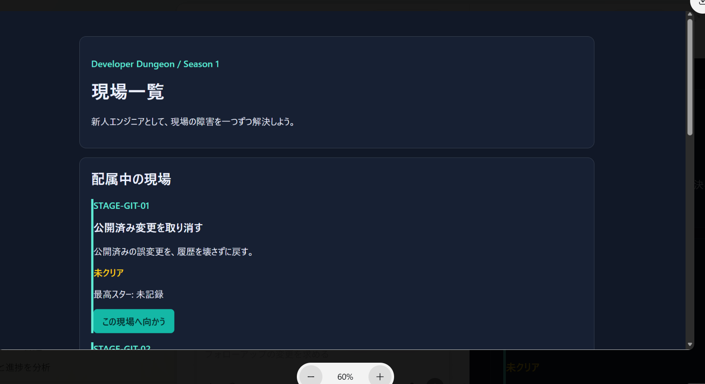
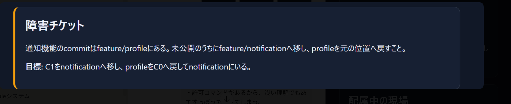

# Phase 5内部プレイ検証・暫定所見

> **一時文書**  
> この文書は、ユーザーによる初回プレイの観察と改善候補を失わずに整理し、次工程を決めるための作業用記録である。正式な要件・設計ではない。採否を決定して正式文書へ反映した後、この文書は削除する。

## 文書情報

- 状態: 暫定整理・採否未確定
- 実施日: 2026-07-14
- 対象: `STAGE-GIT-01`〜`05`
- プレイヤー: Git初心者であるユーザー1名
- 外部支援: Geminiと相談しながら全ステージをプレイ
- 関連文書: [`phase-5-validation-plan.md`](phase-5-validation-plan.md)、[`game-design.md`](game-design.md)

## 1. 暫定結論

全5ステージの題材は、Gitの実務に直結する内容として評価できる。一方、現状は「実務的なGit課題をWeb画面から実行できる」段階に留まり、物語への没入、成功時の達成感、安全な試行錯誤、再挑戦による理解の深化が十分にゲーム体験へ現れていない。

全ステージは外部支援を受けながら解いたため、初心者がアプリ内の情報だけで自力到達できることは確認できていない。許可コマンドの表示と短い固定手順により、理解よりも総当たりや手順暗記で進める余地がある。

暫定判定は`CONDITIONAL`とする。プレイを妨げた技術的Criticalはローカル修正済みだが未反映であり、ゲーム・学習体験には複数の未解決Majorがある。Phase 5完了判定は、採用範囲の決定、修正、対象限定の再確認後に行う。

## 2. 画面の観察記録

### 2.1 現状

ステージ一覧と操作画面はいずれも暗色の大きなパネルが画面全体を占める。日中のオフィスで働く新人エンジニアよりも、暗い部屋でターミナルを操作する印象が強い。ステージ選択後は会話や人物の反応を経ず、障害チケットとGit操作へ直行する。

<table>
  <thead>
    <tr>
      <th>現状のステージ一覧</th>
      <th>現状のコマンド操作画面</th>
    </tr>
  </thead>
  <tbody>
    <tr>
      <td></td>
      <td></td>
    </tr>
  </tbody>
</table>

### 2.2 採用候補の目標

主人公の一人称視点で、明るい日中のオフィスを固定背景として表示する。中央のPC画面内にゲーム操作を置き、先輩、同期、QA担当、運用担当などの会話をPC画面外の吹き出しとして表示する。次の生成画像の構図、明るさ、情報階層を、可能な限り維持する方向を採用候補とする。

<table>
  <thead>
    <tr>
      <th>現状</th>
      <th>目標イメージ</th>
    </tr>
  </thead>
  <tbody>
    <tr>
      <td></td>
      <td></td>
    </tr>
  </tbody>
</table>

画像内の具体的なコマンド、XP、ランキング、メニュー構成は確定仕様ではない。PC画面と吹き出しは操作可能なHTMLとして実装し、生成画像全体を1枚の操作画像として使用しない。

## 3. 維持する長所

- 公開済み履歴の取り消し、branch間のcommit移動、stash、競合解消、reflogなど、題材が実務上の判断へ直結している。
- 実際のGitコマンドとrepository状態を使う方針には学習上の価値がある。
- 最終状態で採点する設計は、固定コマンド列ではなく複数の安全な解法を認める土台になる。
- 段階ヒント、スター、ステージ進行は、表示と評価方法を改善すれば継続利用できる。

## 4. 観察された問題

| ID | 重大度 | 観察 | プレイヤー体験への影響 | 改善方向 |
|---|---|---|---|---|
| UX-01 | Major | 全体が暗く、ゲーム感と日中の社内作業感が弱い | 新人エンジニアの成長物語へ没入できず、ハッカー風ターミナル教材に見える | 一人称オフィス背景、中央PC、PC外の会話へ再構成する |
| UX-02 | Major | ステージ選択後、人物のやり取りなしに課題文とコマンド入力が始まる | 作り込んだ登場人物、関係、成長beatがプレイ中に存在しない | スキップ可能な短い会話から障害チケットへ移るsceneを追加する |
| UX-03 | Major | Stage 1をclearしても、下へスクロールするまで変化が分からない | 成功を認識しにくく、達成感がなく、clear後も入力できるように見える | 大きなclear表示、入力欄の閉鎖、結果位置への自動移動、人物の反応を同時に行う |
| LEARN-01 | Major | 正確な許可コマンドが常時見えるステージでは、浅い理解でも候補を総当たりできる | 状態から仮説を立てず、コマンド当てゲームになる | サーバー側allowlistは維持し、UIは概念カテゴリだけを表示する。具体構文は段階ヒントへ移す |
| LEARN-02 | Major | 多くのステージが5〜6操作で終わる | 解き直しが同じ短い手順の暗記になり、理解の転用を感じにくい | 難度を急上昇させず、調査、仮説、復旧、確認を含む8〜12回程度の意味ある操作を仮説として設計比較する |
| LEARN-03 | Major | 全ステージをGeminiと相談しながら解いた | アプリ内の導入とヒントだけで初心者が自力到達できることを確認できていない | Chapter 0、用語説明、ヒント段階、状況提示を再設計し、外部支援なしの再確認を行う |
| STATE-01 | Major | 2手目で間違えると、正しかった1手目の状態まで戻された | 試行錯誤の積み上げが消え、失敗を恐れて探索しにくい | 入力拒否と通常Gitエラーでは状態を維持する。明示reset、復旧不能なsystem error、隔離境界上必要な場合だけ再生成する |
| STATE-02 | Major | Stage 5の2手目は一意に定まらないと感じた | 調査順序に複数の妥当な選択があるのに、固定手順を要求されているように見える | 最終状態を中心に採点し、複数の安全な調査・復旧順序を許可する。実際に代替経路が通るか対象限定で確認する |
| COPY-01 | Minor | Stage 2の「profileをC0へ戻してnotificationにいる」が不自然 | branch、commit、現在位置の関係が読み取りにくい | branch名を省略せず、最終checkout状態を別文で明示する |

## 5. Stage 2文言の記録

現状の目標文は「C1をnotificationへ移し、profileをC0へ戻してnotificationにいる。」となっている。暫定修正案は次のとおり。

> C1を`feature/notification`へ移し、`feature/profile`をC0へ戻す。最後に`feature/notification`をcheckoutした状態にする。

この文言は正式なStage 2仕様を更新する際に、C0とC1を画面でどのように説明するかも含めて確定する。

## 6. プレイ中に分離した技術障害

次はプレイヤーの理解、所要時間、resetとして評価しない。

| 問題 | 影響 | 現在の状態 |
|---|---|---|
| `RunnerProperties`の設定バインド対象が一意でない | Runnerが起動不能 | canonical constructorを明示するローカル修正済み |
| `JdbcStagePersistence`が`final`でSpringのproxyを生成できない | アプリが起動不能 | proxy可能にするローカル修正済み |
| DBの`command_kind`制約がStage 2〜5の種別を許可しない | 正常コマンドでHTTP 500 | Flyway V2と全現行種別を確認するDB統合テストをローカル追加済み |
| Codexの起動セッション終了後に接続拒否となった | 手動検証が一時中断 | 製品機能ではなく検証環境のプロセス維持問題として分離 |

ローカル修正は未commit・未mergeであるため、Phase 5完了前に独立したruntime修正として差分確認とPR反映が必要である。

## 7. 現時点の採用候補

次はユーザーの感想と既存方針が一致しており、正式設計へ進める有力候補とする。

1. 一人称視点、固定の明るいオフィス背景、中央PC、PC外の人物吹き出しを目標UIとする。
2. ステージ開始を、スキップ可能な会話、障害チケット、調査・復旧の順にする。
3. clear時は大きな完了表示を出して入力を閉じ、結果と人物の反応へ移る。
4. サーバー側のコマンドallowlistは安全境界として維持し、画面上の正確な候補列挙は段階ヒントへ移す。
5. 通常の誤入力やGitエラーで、正しかった過去操作まで自動的に失わせない。
6. Stage 5を含め、最終状態が同じ複数の安全な経路を許可する。
7. 各ステージを単純に難しくするのではなく、調査と確認を増やして意味のある操作過程を長くする。
8. 再挑戦では固定コマンド列の暗記だけで通らない変化を将来検討する。

## 8. 実装前に決めること

- 各ステージで状態を維持する失敗と、安全上workspace再生成が必要な失敗の境界
- Stage 5で許可する複数経路と、それぞれが守る不変条件
- 1ステージの目標操作量。8〜12回は設計比較用の仮説であり確定値ではない
- 調査操作を増やしたとき、許可コマンド一覧を答えのチェックリストにしない表示方法
- 再挑戦で変える対象。object IDだけか、周辺commit、branch名、症状も変えるか
- 会話の量、skip単位、再挑戦時の初期状態
- PC画面の占有率、吹き出し位置、狭い画面での代替表示
- 背景画像をそのまま使用するか、目標画像を基に別の固定背景素材を作るか

## 9. 推奨する次工程

### 工程1: runtime修正を分離して完了する

現在の起動・DB修正を、プレイ体験の再設計と混ぜずに差分確認する。必要なレビューと対象限定テストを終え、独立PRとして`main`へ反映する。

### 工程2: Phase 5の改善範囲を確定する

本書のMajorを、今回修正するものと将来へ回すものに分ける。最低限、clear通知、入力停止、Stage 2文言、通常失敗時の状態維持、Stage 5の複数経路は、再検証前の必須候補として扱う。

### 工程3: 二つの設計トラックへ分ける

1. **体験・画面トラック**: 一人称オフィスUI、会話scene、clear演出、レスポンシブ表示を設計する。物語と人物の見せ方はバムがまとめてレビューする。
2. **学習・状態トラック**: allowlist表示、失敗時の状態維持、複数解法、操作過程の長さ、再挑戦の変化を設計する。attempt lifecycle、cleanup、安全境界を含むため井上が実装前にレビューする。

### 工程4: 正式文書へ反映する

採用内容を`requirements.md`、`game-design.md`、`git-mvp-stages.md`、`architecture.md`、`test-strategy.md`、`roadmap.md`へ依存順に反映する。バムと井上のレビューが必要な変更をまとめて通した後、本一時文書を削除する。

### 工程5: 小さなPR単位で実装する

1. clear通知、入力停止、Stage 2文言など、共通状態を変えにくい改善
2. 一人称オフィスの画面shellとレスポンシブ表示
3. スキップ可能な会話sceneと人物の反応
4. 失敗時の状態維持とStage 5の複数経路
5. 各ステージの調査・確認過程と再挑戦設計の拡張

### 工程6: 対象限定で再確認する

共通UIは5ステージを短く通して確認する。状態維持は誤入力、Gitエラー、明示reset、system recoveryを分けて確認する。Stage 5は少なくとも二つの安全な経路を確認する。初心者導線は外部支援なしでStage 1、2、5を再確認し、必要ならChapter 0を次の優先実装とする。
